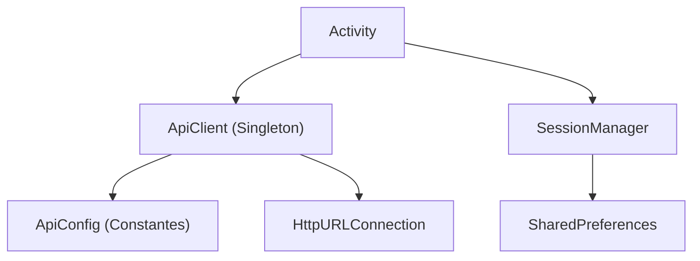
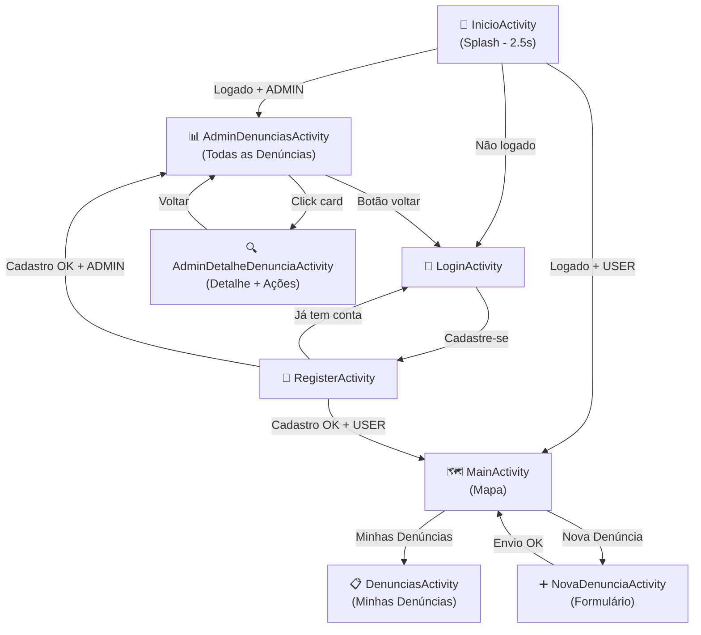

# 📱 CidadãoAlerta — Documentação Técnica do Frontend Android

> **Autor:** Tech Lead Sênior  
> **Data:** Junho 2026  
> **Audiência:** Desenvolvedores Júnior que vão contribuir com o projeto  
> **Projeto:** `Projeto-Integrador` — App Android nativo (Java)

---

## 📋 Índice

1. [Visão Geral do Produto](#1-visão-geral-do-produto)
2. [Stack Tecnológica](#2-stack-tecnológica)
3. [Estrutura do Projeto](#3-estrutura-do-projeto)
4. [Arquitetura e Padrões](#4-arquitetura-e-padrões)
5. [Fluxo de Navegação](#5-fluxo-de-navegação)
6. [Activities — Detalhamento Completo](#6-activities--detalhamento-completo)
7. [Camada de Rede (network/)](#7-camada-de-rede-network)
8. [Gerenciamento de Sessão (session/)](#8-gerenciamento-de-sessão-session)
9. [Recursos Android (res/)](#9-recursos-android-res)
10. [Integração com o Backend](#10-integração-com-o-backend)
11. [Mapeamento de Status](#11-mapeamento-de-status)
12. [Permissões do App](#12-permissões-do-app)
13. [Convenções de Código](#13-convenções-de-código)
14. [Pendências e TODOs](#14-pendências-e-todos)
15. [Como Rodar o Projeto](#15-como-rodar-o-projeto)

---

## 1. Visão Geral do Produto

O **CidadãoAlerta** é um aplicativo Android de **denúncias urbanas**. Cidadãos reportam problemas na cidade (buracos, iluminação quebrada, lixo acumulado etc.) com fotos e localização GPS, e administradores da prefeitura gerenciam essas denúncias, atualizando seus status.

### Funcionalidades Principais

| Papel | O que pode fazer |
|-------|-----------------|
| **Cidadão (USER)** | Cadastrar conta, ver mapa com suas denúncias, criar nova denúncia (com foto + localização), listar suas denúncias |
| **Admin (ADMIN)** | Visualizar todas as denúncias, ver detalhes, alterar status (ABERTA → EM_ANALISE → RESOLVIDA), enviar devolutiva |

---

## 2. Stack Tecnológica

| Camada | Tecnologia | Versão / Detalhes |
|--------|-----------|-------------------|
| **Linguagem** | Java | JDK 11 (source/target compatibility) |
| **Build** | Gradle Kotlin DSL | `build.gradle.kts` |
| **Min SDK** | 24 | Android 7.0 Nougat |
| **Target SDK** | 36 | Android 16 |
| **UI** | Material Design 3 | `Theme.Material3.DayNight.NoActionBar` |
| **Componentes UI** | Material Components | `com.google.android.material:material:1.11.0` |
| **Mapas** | OSMDroid | `org.osmdroid:osmdroid-android:6.1.18` |
| **Localização** | Google Play Services Location | `play-services-location:21.2.0` |
| **HTTP** | `HttpURLConnection` nativo | Sem libs externas (Retrofit, OkHttp etc.) |
| **JSON** | `org.json` nativo do Android | `JSONObject`, `JSONArray` |
| **Sessão** | `SharedPreferences` | Persistência local simples |

> [!IMPORTANT]
> **Não usamos Retrofit, OkHttp, Glide, Picasso ou qualquer lib de terceiros para rede/imagem.** Toda a comunicação HTTP é feita via `HttpURLConnection` puro dentro do [ApiClient.java](file:///c:/Users/Pedro/Documents/Pedro/Projeto-integrador-frontend/app/src/main/java/com/example/projeto_integrador/network/ApiClient.java). Isso foi uma decisão consciente para minimizar dependências.

---

## 3. Estrutura do Projeto

```
Projeto-integrador-frontend/
├── app/
│   ├── build.gradle.kts              ← Dependências e config do módulo
│   └── src/main/
│       ├── AndroidManifest.xml        ← Activities, permissões, configs
│       ├── java/com/example/projeto_integrador/
│       │   ├── InicioActivity.java           ← Splash screen (entry point)
│       │   ├── LoginActivity.java            ← Tela de login
│       │   ├── RegisterActivity.java         ← Tela de cadastro
│       │   ├── MainActivity.java             ← Tela principal (mapa USER)
│       │   ├── DenunciasActivity.java        ← Lista denúncias do USER
│       │   ├── NovaDenunciaActivity.java     ← Formulário nova denúncia
│       │   ├── AdminDenunciasActivity.java   ← Lista denúncias (ADMIN)
│       │   ├── AdminDetalheDenunciaActivity.java ← Detalhe denúncia (ADMIN)
│       │   ├── network/
│       │   │   ├── ApiClient.java            ← Cliente HTTP singleton
│       │   │   └── ApiConfig.java            ← URLs e paths da API
│       │   └── session/
│       │       └── SessionManager.java       ← Gerenciamento de sessão local
│       └── res/
│           ├── layout/                       ← 10 XMLs de layout
│           ├── drawable/                     ← Ícones e shapes
│           ├── values/                       ← colors, strings, themes
│           └── xml/                          ← network_security_config
├── build.gradle.kts                   ← Config root (plugins)
├── settings.gradle.kts                ← Nome do projeto e módulos
└── api_routes.md                      ← Documentação das rotas do backend
```

---

## 4. Arquitetura e Padrões

### Padrão Geral

O projeto segue uma arquitetura simples com **Activities puras** (sem Fragments, sem MVVM, sem ViewModel). Cada tela é uma Activity independente.



### Responsabilidades

| Componente | Responsabilidade |
|-----------|-----------------|
| **Activity** | Lógica de UI, bind de views, validação, navegação |
| **ApiClient** | Execução de requests HTTP (GET, POST, PATCH, multipart) em background thread |
| **ApiConfig** | Centraliza BASE_URL e todos os paths da API |
| **SessionManager** | CRUD de dados do usuário logado em SharedPreferences |

> [!NOTE]
> **Não há camada de Repository, ViewModel, UseCase ou Model.** Os dados são parseados diretamente como `JSONObject`/`JSONArray` dentro das Activities. Para um projeto acadêmico/integrador, isso é aceitável, mas saibam que em produção isso seria organizado em camadas.

---

## 5. Fluxo de Navegação



### Regras de Navegação Importantes

- **InicioActivity** é o `LAUNCHER`. Ela **sempre roda por 2.5 segundos** (splash) e depois redireciona automaticamente.
- Após login/cadastro, o app usa `FLAG_ACTIVITY_NEW_TASK | FLAG_ACTIVITY_CLEAR_TASK` para limpar a back stack. O usuário **não pode voltar para a tela de login** apertando "back".
- O botão "voltar" na **AdminDenunciasActivity** faz **logout** e redireciona ao login (não é um simples `finish()`).

---

## 6. Activities — Detalhamento Completo

### 6.1. InicioActivity (Splash Screen)

**Arquivo:** [InicioActivity.java](file:///c:/Users/Pedro/Documents/Pedro/Projeto-integrador-frontend/app/src/main/java/com/example/projeto_integrador/InicioActivity.java)  
**Layout:** `activity_inicio.xml`

**O que faz:**
1. Exibe layout de splash por **2.5 segundos**
2. Verifica `SessionManager.isLoggedIn()`
3. Se logado: verifica `isAdmin()` → redireciona para `AdminDenunciasActivity` ou `MainActivity`
4. Se não logado: redireciona para `LoginActivity`
5. Chama `finish()` para se remover da pilha

> [!TIP]
> Se precisar mudar o tempo da splash, altere o valor `2500` no `Handler.postDelayed()`.

---

### 6.2. LoginActivity

**Arquivo:** [LoginActivity.java](file:///c:/Users/Pedro/Documents/Pedro/Projeto-integrador-frontend/app/src/main/java/com/example/projeto_integrador/LoginActivity.java)  
**Layout:** `activity_login.xml`

**O que faz:**
- Exibe campos de email e senha
- Botão "Entrar" → **ainda não integrado** (exibe Snackbar de aviso)
- Link "Cadastre-se" → navega para `RegisterActivity`
- Se o usuário **já está logado** quando essa Activity abre, redireciona direto

> [!WARNING]
> **O botão de Login NÃO funciona.** Existe um TODO no código (linha 68). O endpoint `/login` do backend ainda não existe. Atualmente, a única forma de entrar é via **cadastro**.

**Componentes:** `TextInputEditText` (email, senha), `MaterialButton` (login), `TextView` (link cadastro)

---

### 6.3. RegisterActivity

**Arquivo:** [RegisterActivity.java](file:///c:/Users/Pedro/Documents/Pedro/Projeto-integrador-frontend/app/src/main/java/com/example/projeto_integrador/RegisterActivity.java)  
**Layout:** `activity_register.xml`

**O que faz:**
1. Valida campos (nome, email, senha ≥ 6 chars)
2. Envia `POST /usuarios` com `{ nome, email, password }`
3. Se sucesso: salva sessão com `SessionManager.saveUser()` e redireciona por role
4. Trata erros: 409 (email duplicado), 400 (dados inválidos), -1 (sem conexão)

**Fluxo de validação:**
- Nome vazio → erro "Informe seu nome completo"
- Email vazio ou inválido → erro correspondente
- Senha < 6 chars → erro "A senha deve ter ao menos 6 caracteres"

**Feedback visual:** O botão muda para "Criando conta..." e fica desabilitado durante a requisição.

---

### 6.4. MainActivity (Tela Principal — USER)

**Arquivo:** [MainActivity.java](file:///c:/Users/Pedro/Documents/Pedro/Projeto-integrador-frontend/app/src/main/java/com/example/projeto_integrador/MainActivity.java)  
**Layout:** `activity_main.xml`

**O que faz:**
- Exibe mapa OSMDroid centralizado em **Indaiatuba/SP** (`-23.0882, -47.2234`)
- Carrega denúncias do usuário logado via `GET /denuncias/usuario/{userId}` e plota marcadores
- Botão "Nova Denúncia" → `NovaDenunciaActivity`
- Botão "Minhas Denúncias" → `DenunciasActivity`

**Ciclo de vida:**
- `onResume()`: limpa overlays e recarrega marcadores (garante dados atualizados ao voltar)
- `onPause()`: pausa o mapa

> [!NOTE]
> O mapa padrão é sempre centrado em Indaiatuba. Se o app for usado em outra cidade, esse ponto precisa ser ajustado ou deve ser usada a localização do usuário.

---

### 6.5. DenunciasActivity (Minhas Denúncias — USER)

**Arquivo:** [DenunciasActivity.java](file:///c:/Users/Pedro/Documents/Pedro/Projeto-integrador-frontend/app/src/main/java/com/example/projeto_integrador/DenunciasActivity.java)  
**Layout:** `activity_denuncias.xml` + `item_denuncia.xml` (card inflado)

**O que faz:**
- Lista todas as denúncias do usuário logado (`GET /denuncias/usuario/{userId}`)
- Cada card mostra: título, descrição, badge de status, botão expandir
- Ao expandir: mostra endereço (geocodificação reversa) + mini-mapa OSMDroid
- Botão voltar → `finish()`

**Card de denúncia (item_denuncia.xml):**

| Componente | ID | Descrição |
|-----------|-----|-----------|
| Título | `textTitulo` | Título da denúncia |
| Descrição | `textDescricao` | Texto descritivo |
| Badge status | `layoutStatus` + `dotStatus` + `textStatus` | Badge colorido por status |
| Expandir | `buttonExpandir` + `iconExpandir` | Ícone que roda 180° ao expandir |
| Endereço | `textEndereco` | Resultado da geocodificação reversa |
| Mini-mapa | `mapMini` | Mapa read-only com marcador |

---

### 6.6. NovaDenunciaActivity (Formulário — USER)

**Arquivo:** [NovaDenunciaActivity.java](file:///c:/Users/Pedro/Documents/Pedro/Projeto-integrador-frontend/app/src/main/java/com/example/projeto_integrador/NovaDenunciaActivity.java)  
**Layout:** `activity_nova_denuncia.xml` + `dialog_map.xml` (modal do mapa)

**É a Activity mais complexa do app.** Ela:

1. **Carrega categorias** da API (`GET /categorias`) e popula um Spinner
2. **Captura foto** via câmera ou galeria (ActivityResultLauncher)
3. **Obtém localização** via GPS atual ou seleção no mapa (modal)
4. **Envia denúncia** via `POST /denuncias` (multipart/form-data)

**Campos do formulário:**

| Campo | Tipo | Obrigatório |
|-------|------|:-----------:|
| Título | `EditText` | ✅ |
| Categoria | `Spinner` (carregado da API) | ✅ |
| Descrição | `EditText` | ✅ |
| Foto | Câmera / Galeria | ❌ |
| Localização | GPS / Mapa | ✅ |

**Fluxo de foto:**
```
imageContainer (click) → PopupMenu → "Tirar foto" → cameraLauncher
                                    → "Escolher da galeria" → galeriaLauncher
```

**Fluxo de localização:**
```
buttonLocalAtual → FusedLocationProviderClient.getLastLocation()
                  → Atualiza lat/lng + endereço + mini-mapa preview

buttonSelecionarMapa → Dialog com MapView full
                      → Tap no mapa posiciona marcador
                      → Confirmar salva lat/lng
```

**Envio:**
- Monta `Map<String, String>` com campos de texto
- Se tem foto: converte para `byte[]` (URI via InputStream ou Bitmap via compress JPEG 85%)
- Envia via `ApiClient.postMultipart()`

> [!IMPORTANT]
> O envio usa `multipart/form-data`, **NÃO JSON**. Isso é porque o backend espera `@RequestParam` + `MultipartFile` nessa rota.

---

### 6.7. AdminDenunciasActivity (Lista — ADMIN)

**Arquivo:** [AdminDenunciasActivity.java](file:///c:/Users/Pedro/Documents/Pedro/Projeto-integrador-frontend/app/src/main/java/com/example/projeto_integrador/AdminDenunciasActivity.java)  
**Layout:** `activity_admin_denuncias.xml`

**O que faz:**
- Lista **todas** as denúncias (`GET /denuncias/admin`)
- Cards construídos **programaticamente** (não inflados de XML) — cada card exibe: título, nome do cidadão, data, descrição (2 linhas), badge de status
- Ao clicar no card → abre `AdminDetalheDenunciaActivity` passando dados via `Intent.putExtra()`

**Dados passados via Intent:**

| Extra | Tipo | Descrição |
|-------|------|-----------|
| `denunciaId` | String (UUID) | ID da denúncia |
| `tipo` | String | Título |
| `cidadao` | String | Nome do usuário |
| `data` | String | Data formatada dd/MM/yyyy |
| `descricao` | String | Descrição |
| `status` | String | Status já formatado para display |
| `latitude` | double | Latitude |
| `longitude` | double | Longitude |

> [!WARNING]
> O botão "voltar" desta Activity faz **logout**. O `SessionManager.logout()` limpa os SharedPreferences e redireciona ao login com clear task. Isso funciona como "sair da conta" para o admin.

---

### 6.8. AdminDetalheDenunciaActivity (Detalhe — ADMIN)

**Arquivo:** [AdminDetalheDenunciaActivity.java](file:///c:/Users/Pedro/Documents/Pedro/Projeto-integrador-frontend/app/src/main/java/com/example/projeto_integrador/AdminDetalheDenunciaActivity.java)  
**Layout:** `activity_admin_detalhe_denuncia.xml`

**O que faz:**
- Exibe detalhes completos da denúncia
- Mapa mini read-only com marcador
- Endereço via geocodificação reversa
- **Spinner de status** com opções: "EM ANÁLISE", "EM ANDAMENTO", "CONCLUÍDO"
- **Botão salvar status** → `PATCH /denuncias/{id}/update-status/{statusEnum}`
- **Card de devolutiva** aparece quando status = "CONCLUÍDO"

**Fluxo de atualização de status:**
```
Spinner seleciona novo status
  → Se "CONCLUÍDO" → mostra card de devolutiva
  → Botão "Salvar status" → mapearStatusParaEnum() → PATCH via API
  → Sucesso → atualiza badge visual
```

> [!CAUTION]
> O envio de devolutiva **NÃO está integrado com o backend.** O botão "Enviar devolutiva" apenas exibe um Snackbar e desabilita o campo. Existe um TODO na linha 230 do código.

---

## 7. Camada de Rede (network/)

### 7.1. ApiConfig — Constantes de URL

**Arquivo:** [ApiConfig.java](file:///c:/Users/Pedro/Documents/Pedro/Projeto-integrador-frontend/app/src/main/java/com/example/projeto_integrador/network/ApiConfig.java)

```java
public static final String BASE_URL = "http://10.64.22.159:8080";

// Paths disponíveis:
USUARIOS            = "/usuarios"
USUARIOS_ADMIN      = "/usuarios/admin"
DENUNCIAS           = "/denuncias"
DENUNCIAS_ADMIN     = "/denuncias/admin"
DENUNCIAS_POR_USUARIO = "/denuncias/usuario"
DENUNCIAS_UPDATE_STATUS = "/update-status"
CATEGORIAS          = "/categorias"
CATEGORIAS_ADMIN    = "/categorias/admin"
LOGIN               = "/login"
```

**Helper:** `ApiConfig.url("/usuarios")` → `"http://10.64.22.159:8080/usuarios"`

> [!IMPORTANT]
> **A `BASE_URL` aponta para um IP de rede local.** Quando o backend mudar de ambiente (outro computador, servidor de produção), é necessário alterar **apenas** essa constante. Quando testar no emulador com backend local, use `10.0.2.2` em vez de `localhost`.

---

### 7.2. ApiClient — Cliente HTTP

**Arquivo:** [ApiClient.java](file:///c:/Users/Pedro/Documents/Pedro/Projeto-integrador-frontend/app/src/main/java/com/example/projeto_integrador/network/ApiClient.java)

**Padrão Singleton:** `ApiClient.getInstance()`

**Thread model:**
- Requests rodam em background via `ExecutorService` (pool de 4 threads)
- Callbacks (`OnSuccessListener`, `OnErrorListener`) são despachados na **main thread** via `Handler(Looper.getMainLooper())`

**Métodos disponíveis:**

| Método | Assinatura | Uso |
|--------|-----------|-----|
| `get` | `get(path, onSuccess, onError)` | GET simples |
| `post` | `post(path, JSONObject, onSuccess, onError)` | POST com body JSON |
| `postMultipart` | `postMultipart(path, textFields, fileFields, fileNames, onSuccess, onError)` | POST multipart/form-data |
| `patch` | `patch(path, JSONObject, onSuccess, onError)` | PATCH com body JSON |
| `patchNoBody` | `patchNoBody(path, onSuccess, onError)` | PATCH sem body (ex: update-status via URL) |

**Callbacks:**
```java
// Sucesso — recebe o body como String (você parsea manualmente)
interface OnSuccessListener {
    void onSuccess(String responseBody);
}

// Erro — recebe status code e mensagem
interface OnErrorListener {
    void onError(int statusCode, String message);
    // statusCode = -1 significa erro de conexão (sem rede / backend offline)
}
```

**Exemplo de uso:**
```java
ApiClient.getInstance().get(
    ApiConfig.DENUNCIAS_POR_USUARIO + "/" + userId,
    response -> {
        JSONArray array = new JSONArray(response);
        // processar...
    },
    (code, msg) -> {
        // tratar erro...
    }
);
```

> [!WARNING]
> **Workaround para PATCH:** O `HttpURLConnection` do Android não suporta PATCH nativamente em todas as versões. O código envia como `POST` com o header `X-HTTP-Method-Override: PATCH`. O backend Spring aceita isso normalmente.

**Timeout:** 15 segundos tanto para conexão quanto para leitura.

---

## 8. Gerenciamento de Sessão (session/)

**Arquivo:** [SessionManager.java](file:///c:/Users/Pedro/Documents/Pedro/Projeto-integrador-frontend/app/src/main/java/com/example/projeto_integrador/session/SessionManager.java)

Usa `SharedPreferences` com o nome `"cidadao_alerta_session"`.

**Dados armazenados:**

| Chave | Método de leitura | Tipo |
|-------|------------------|------|
| `is_logged_in` | `isLoggedIn()` | boolean |
| `user_id` | `getUserId()` | String (UUID) |
| `user_name` | `getUserName()` | String |
| `user_email` | `getUserEmail()` | String |
| `user_role` | `getUserRole()` | String ("USER" / "ADMIN") |

**Métodos principais:**

```java
// Salvar após login/cadastro
session.saveUser(id, nome, email, role);

// Verificar
session.isLoggedIn();   // → boolean
session.isAdmin();      // → true se role == "ADMIN"

// Encerrar sessão
session.logout();       // → limpa tudo
```

> [!NOTE]
> **Não há token JWT ou autenticação real.** A "sessão" é apenas os dados do usuário salvos localmente. Qualquer pessoa pode forjar uma sessão admin editando os SharedPreferences. Isso é aceitável para o escopo do projeto integrador.

---

## 9. Recursos Android (res/)

### 9.1. Layouts (10 arquivos)

| Arquivo | Tela |
|---------|------|
| `activity_inicio.xml` | Splash screen |
| `activity_login.xml` | Tela de login |
| `activity_register.xml` | Tela de cadastro |
| `activity_main.xml` | Mapa principal (USER) |
| `activity_denuncias.xml` | Lista de denúncias (USER) |
| `activity_nova_denuncia.xml` | Formulário nova denúncia |
| `activity_admin_denuncias.xml` | Lista de denúncias (ADMIN) |
| `activity_admin_detalhe_denuncia.xml` | Detalhe da denúncia (ADMIN) |
| `dialog_map.xml` | Modal de seleção no mapa |
| `item_denuncia.xml` | Card de denúncia (inflado dinamicamente) |

### 9.2. Cores (Design System)

Definidas em [colors.xml](file:///c:/Users/Pedro/Documents/Pedro/Projeto-integrador-frontend/app/src/main/res/values/colors.xml):

| Nome | Hex | Uso |
|------|-----|-----|
| `primary` | `#1A3A5C` | Azul marinho — títulos, textos principais |
| `primary_dark` | `#0F2440` | Variante escura |
| `accent` | `#F5A623` | Âmbar — destaques, badges "Em Análise" |
| `background` | `#F0F4F8` | Fundo geral cinza-azulado |
| `surface` | `#FFFFFF` | Cards e superfícies |
| `text_primary` | `#1A3A5C` | Texto primário |
| `text_secondary` | `#607D9B` | Texto secundário |

### 9.3. Strings

- `app_name` = `"CidadãoAlerta"`
- `tipos_denuncia` = array com 15 tipos (legado — as categorias agora vêm da API)
- `status_denuncia` = `["EM ANÁLISE", "EM ANDAMENTO", "CONCLUÍDO"]` — usado no Spinner admin

### 9.4. Tema

Tema base: `Theme.Material3.DayNight.NoActionBar` — Material 3 sem ActionBar nativa.

### 9.5. Network Security Config

Em [network_security_config.xml](file:///c:/Users/Pedro/Documents/Pedro/Projeto-integrador-frontend/app/src/main/res/xml/network_security_config.xml):

```xml
<domain-config cleartextTrafficPermitted="true">
    <domain includeSubdomains="true">10.64.22.159</domain>
</domain-config>
```

> [!IMPORTANT]
> Android 9+ bloqueia tráfego HTTP (cleartext) por padrão. Sem essa config, todas as chamadas ao backend falhariam. **Se mudar o IP do backend, atualize TAMBÉM este arquivo.**

---

## 10. Integração com o Backend

### Rotas utilizadas pelo app

| Activity | Método | Rota | Content-Type |
|----------|--------|------|--------------|
| RegisterActivity | `POST` | `/usuarios` | `application/json` |
| MainActivity | `GET` | `/denuncias/usuario/{id}` | — |
| DenunciasActivity | `GET` | `/denuncias/usuario/{id}` | — |
| NovaDenunciaActivity | `GET` | `/categorias` | — |
| NovaDenunciaActivity | `POST` | `/denuncias` | `multipart/form-data` |
| AdminDenunciasActivity | `GET` | `/denuncias/admin` | — |
| AdminDetalheDenunciaActivity | `PATCH` | `/denuncias/{id}/update-status/{status}` | — |

### Rotas declaradas mas NÃO usadas ainda

| Rota | Motivo |
|------|--------|
| `POST /login` | Endpoint não existe no backend |
| `GET /usuarios/admin` | Não há tela de listagem de usuários |
| `PATCH /usuarios/{id}` | Não há tela de edição de perfil |
| `POST /categorias/admin` | Não há tela de criação de categorias |
| `PATCH /categorias/{id}` | Não há tela de edição de categorias |

Para referência completa das rotas do backend, consulte [api_routes.md](file:///c:/Users/Pedro/Documents/Pedro/Projeto-integrador-frontend/api_routes.md).

---

## 11. Mapeamento de Status

Este é um ponto **crítico e confuso** do projeto. O backend usa enums e o frontend usa textos diferentes para display:

### Backend → Frontend (ao exibir)

| Enum Backend | Display no app (USER) | Display no app (ADMIN) |
|-------------|----------------------|----------------------|
| `ABERTA` | "EM ANDAMENTO" (azul) | "ABERTA" (azul) |
| `EM_ANALISE` | "EM ANÁLISE" (amarelo) | "EM ANÁLISE" (amarelo) |
| `RESOLVIDA` | "CONCLUÍDO" (verde) | "RESOLVIDA" (verde) |

### Frontend → Backend (ao salvar)

| Display no Spinner | Enum enviado ao backend |
|-------------------|------------------------|
| "EM ANÁLISE" | `EM_ANALISE` |
| "EM ANDAMENTO" | `EM_ANALISE` |
| "CONCLUÍDO" | `RESOLVIDA` |

### Cores dos badges

| Status | Background | Foreground (dot + texto) |
|--------|-----------|-------------------------|
| Aberta/Em Andamento | `#D6EAFF` (azul claro) | `#2B7DE9` (azul) |
| Em Análise | `#FFF3D6` (amarelo claro) | `#F5A623` (âmbar) |
| Resolvida/Concluído | `#D6F5E0` (verde claro) | `#27AE60` (verde) |

> [!WARNING]
> O mapeamento de status é **inconsistente** entre as telas. `DenunciasActivity` mostra "ABERTA" como "EM ANDAMENTO", enquanto `AdminDenunciasActivity` mostra como "ABERTA". Isso deveria ser padronizado. Tenham cuidado ao mexer nessa lógica.

---

## 12. Permissões do App

Declaradas no [AndroidManifest.xml](file:///c:/Users/Pedro/Documents/Pedro/Projeto-integrador-frontend/app/src/main/AndroidManifest.xml):

| Permissão | Uso | Tipo |
|-----------|-----|------|
| `INTERNET` | Chamadas HTTP ao backend | Normal (automática) |
| `ACCESS_NETWORK_STATE` | Verificar estado da rede | Normal |
| `ACCESS_COARSE_LOCATION` | Localização aproximada | Perigosa (runtime) |
| `ACCESS_FINE_LOCATION` | Localização precisa (GPS) | Perigosa (runtime) |
| `CAMERA` | Tirar foto da denúncia | Perigosa (runtime) |

> A câmera é declarada como `required="false"` — o app funciona em dispositivos sem câmera.

**Solicitação em runtime:** As permissões de câmera e localização são solicitadas em runtime na `NovaDenunciaActivity`, usando `ActivityCompat.requestPermissions()`.

---

## 13. Convenções de Código

### Nomenclatura

| Elemento | Convenção | Exemplo |
|---------|-----------|---------|
| Activities | PascalCase + `Activity` | `NovaDenunciaActivity` |
| Views em Java | camelCase com prefixo do tipo | `editTitulo`, `buttonEnviar`, `textDescricao` |
| IDs no XML | camelCase | `@+id/editEmail`, `@+id/buttonLogin` |
| Métodos | camelCase em português | `carregarDenuncias()`, `configurarEventos()` |
| Constantes | UPPER_SNAKE_CASE | `BASE_URL`, `KEY_LOGGED` |

### Padrão de inicialização nas Activities

```java
@Override
protected void onCreate(Bundle savedInstanceState) {
    super.onCreate(savedInstanceState);
    setContentView(R.layout.activity_xxx);

    // 1. Session
    session = new SessionManager(this);

    // 2. Bind views
    iniciarComponentes();   // ou bindViews()

    // 3. Configurar listeners
    configurarEventos();    // ou setupListeners()

    // 4. Carregar dados
    carregarDenuncias();    // ou carregarCategorias()
}
```

### Tratamento de erros nas chamadas de API

O projeto usa um padrão consistente:

```java
ApiClient.getInstance().get(path,
    response -> {
        // Sucesso: parsear JSON e atualizar UI
    },
    (code, msg) -> {
        // Erro:
        // code == -1 → sem conexão
        // code == 409 → conflito (ex: email duplicado)
        // code == 400 → dados inválidos
        // outros → erro genérico
    }
);
```

---

## 14. Pendências e TODOs

| Prioridade | O quê | Onde | Detalhes |
|:----------:|-------|------|----------|
| 🔴 Alta | **Implementar login** | [LoginActivity.java:68](file:///c:/Users/Pedro/Documents/Pedro/Projeto-integrador-frontend/app/src/main/java/com/example/projeto_integrador/LoginActivity.java#L68) | O botão login só exibe aviso. Precisa de endpoint `/login` no backend. |
| 🟡 Média | **Integrar devolutiva** | [AdminDetalheDenunciaActivity.java:230](file:///c:/Users/Pedro/Documents/Pedro/Projeto-integrador-frontend/app/src/main/java/com/example/projeto_integrador/AdminDetalheDenunciaActivity.java#L230) | Botão funciona localmente mas não envia ao backend. |
| 🟡 Média | **Padronizar mapeamento de status** | Múltiplos arquivos | "ABERTA" aparece como "EM ANDAMENTO" para USER e "ABERTA" para ADMIN. |
| 🟢 Baixa | **Logout para USER** | `MainActivity` | Não existe botão de logout para cidadãos. O USER fica logado "para sempre". |
| 🟢 Baixa | **Tratamento de lifecycle dos mapMini** | [DenunciasActivity.java:219](file:///c:/Users/Pedro/Documents/Pedro/Projeto-integrador-frontend/app/src/main/java/com/example/projeto_integrador/DenunciasActivity.java#L219) | Mapas da lista não recebem `onPause()`/`onResume()` corretamente. |
| 🟢 Baixa | **Exibir imagens das denúncias** | `DenunciasActivity`, `AdminDetalheDenunciaActivity` | As denúncias podem ter imagens, mas nenhuma tela as exibe. |

---

## 15. Como Rodar o Projeto

### Pré-requisitos

- **Android Studio** (versão recente com suporte a Gradle KTS e SDK 36)
- **JDK 11+**
- **Backend rodando** (Spring Boot na porta 8080)

### Passos

1. Clone o repositório
2. Abra no Android Studio
3. **Configure o IP do backend** em [ApiConfig.java:14](file:///c:/Users/Pedro/Documents/Pedro/Projeto-integrador-frontend/app/src/main/java/com/example/projeto_integrador/network/ApiConfig.java#L14):
   ```java
   public static final String BASE_URL = "http://SEU_IP:8080";
   ```
4. **Atualize o network security config** em [network_security_config.xml](file:///c:/Users/Pedro/Documents/Pedro/Projeto-integrador-frontend/app/src/main/res/xml/network_security_config.xml):
   ```xml
   <domain includeSubdomains="true">SEU_IP</domain>
   ```
5. Sync Gradle e rode no emulador ou dispositivo físico

> [!TIP]
> Se estiver usando **emulador** com backend rodando na máquina local, use o IP `10.0.2.2` (que aponta para o `localhost` do host). Em **dispositivo físico**, use o IP da máquina na rede local (ex: `192.168.x.x`).

### Checklist antes de testar

- [ ] Backend está rodando na porta 8080?
- [ ] IP no `ApiConfig.java` está correto?
- [ ] IP no `network_security_config.xml` está correto?
- [ ] Pelo menos uma categoria existe no banco? (senão o Spinner fica vazio)
- [ ] O dispositivo/emulador tem acesso à rede do backend?

---

> **Última atualização:** 07/06/2026
